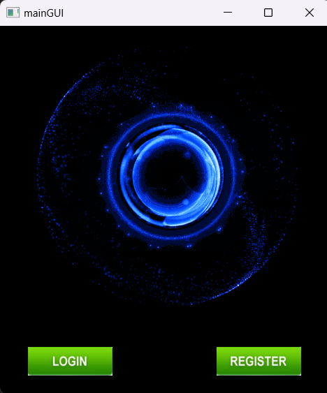
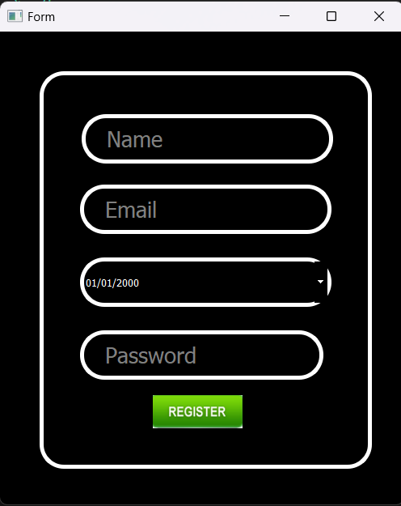
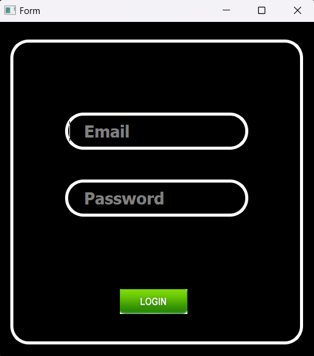
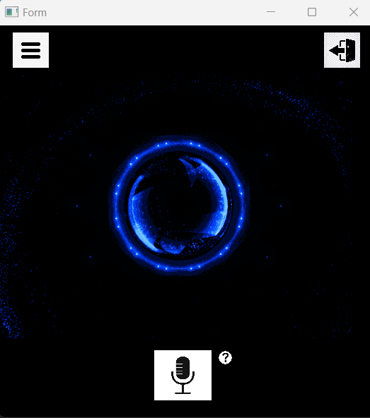
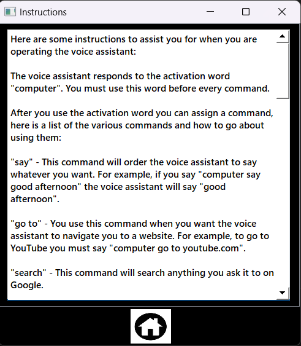
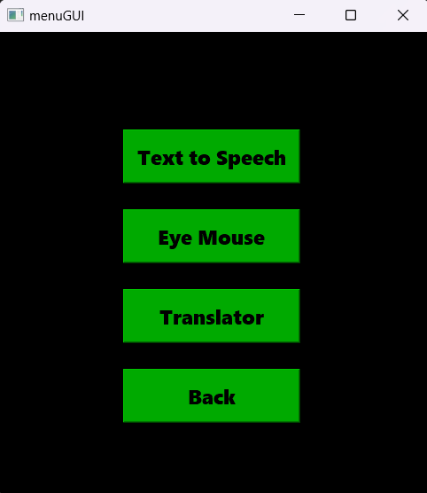
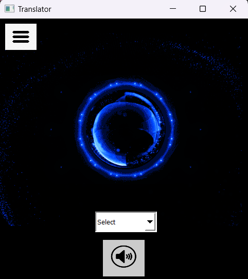
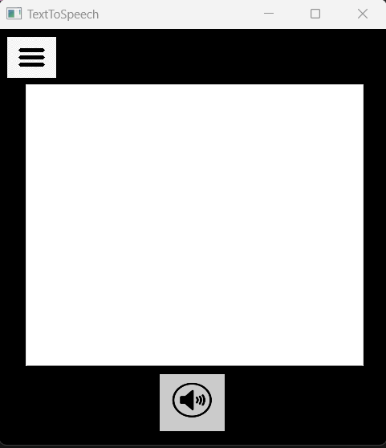
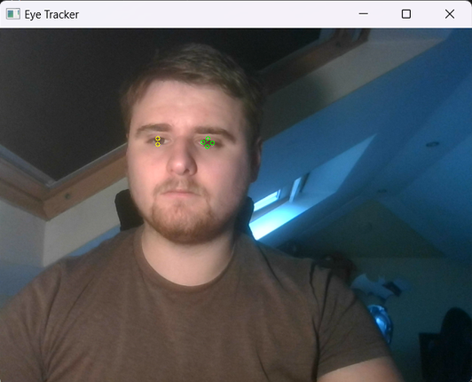

# 4thYearProject

## Description
4thYearProject is a desktop assistant designed to assist users who may struggle with the use of technology, such as the elderly or disabled. The project features a login/register system connected to a local MySQL database for secure storage and verification of user information. The main page includes a voice assistant with a help page attached with list of accepted commands. It includes various subpages with features beneficial for the technologically illiterate, such as a translator, text-to-speech, and eye-tracking mouse control.

## Table of Contents
1. [Installation](#installation)
2. [Usage](#usage)
3. [Features](#features)
4. [Screenshots](#screenshots)

## Installation

### Prerequisites
- Python 3.8 or higher
- MySQL server
- `pip` (Python package installer)

### Steps
1. Clone the repository:
    ```bash
    git clone https://github.com/yourusername/4thYearProject.git
    ```
2. Navigate to the project directory:
    ```bash
    cd 4thYearProject
    ```
3. Personalize code:
    ```bash
    Adjust your code accordingly (API keys, Phillips Hue light information, etc.)
    ```
4. Set up the MySQL database:
      ```bash
      Create a new database
      ```
5. Run the application:
    ```bash
    python main.py
    ```

## Usage
Once the application is launched, users can log in or register a new account. After logging in, they can navigate through the various subpages to use different features.

### Subpages
- **Translator Page:** Allows users to translate English to other languages through speech.
- **Text-to-Speech Page:** Users can type or paste a word or sentence to have it read aloud. This feature is useful for the dyslexic and the mute.
- **Eye Tracker Page:** Enables users to control their mouse through eye movement. The mouse follows the left eye, and closing the right eye simulates a click.

### Main Feature
The voice assistant is a speech recognition model trained using Microsoft Azure. Users can issue voice commands to:
- Open websites
- Search on Google
- Open/close applications
- Write Word documents
- Play music
- Control Phillips Hue lighting
- Ask ChatGPT questions

## Features
- **Login/Register System:** Secure storage and verification of user information using MySQL.
- **Translator:** Speech-based translation from English to other languages.
- **Text-to-Speech:** Converts typed text to speech, aiding dyslexic and mute users.
- **Eye Tracker:** Mouse control through eye movement, with click simulation by closing the right eye.
- **Voice Assistant:** Performs various tasks through voice commands, integrated with APIs for extended functionality.

## Screenshots


















